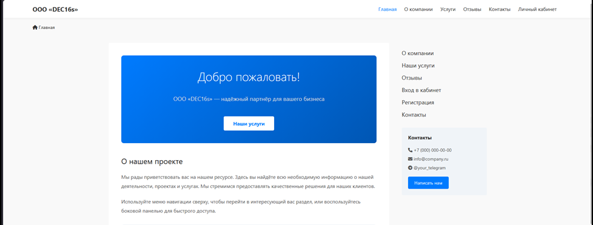
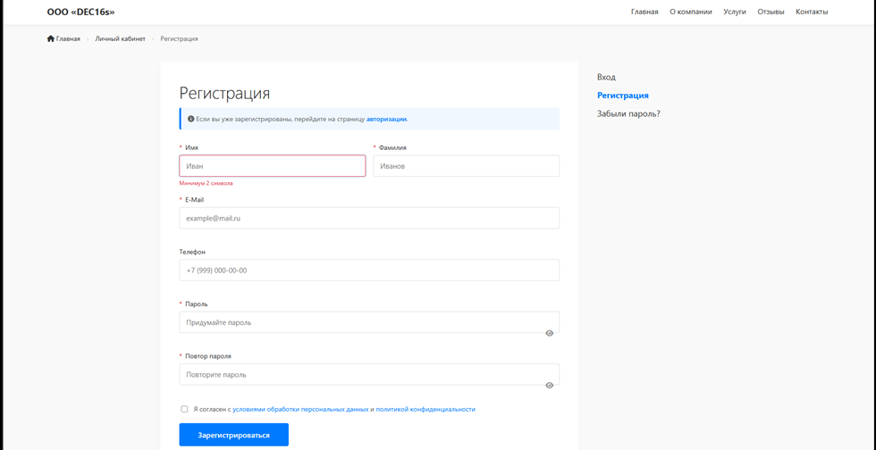

# Secure PHP Website Template

A small-business website template built from scratch with **PHP + MySQL**, with security built in from the start: user accounts with e-mail verification, a reviews system with moderation, and an admin panel.

It was created as the practical part of a diploma project on building a secure website template protected by a WAF and SSL/TLS certificates.

| Home | Registration |
|:--:|:--:|
|  |  |

## Features

- Pages: home, about, services, contacts, reviews, login, registration, profile, admin panel
- Registration with an **e-mail verification code** (PHPMailer over SMTP)
- Login with **bcrypt** password hashing (cost 12), attempt limit with temporary lockout, audit log
- Profile editing, password change, account deletion (confirmed with the password)
- Reviews with **moderation**: new reviews are hidden until an admin approves them
- Session cookies with `HttpOnly`, `Secure` and `SameSite` flags
- Responsive pages in plain HTML, CSS and JavaScript

## Security notes

- All database queries use **PDO prepared statements** (protection against SQL injection)
- User input is validated on the server; review text is stripped of tags and escaped (protection against XSS)
- Secrets live in `config.php`, which is excluded from git
- TLS (Let's Encrypt), security headers (HSTS, CSP) and the WAF were configured at the hosting / proxy level and are **not part of this repository**

## Tech stack

PHP 8.1+, MySQL / MariaDB, PDO, Apache (`.htaccess`), HTML / CSS / JavaScript, PHPMailer.

## Setup

1. **Database.** Import `database/schema.sql` (it creates two databases: `site_users` and `site_reviews`, structure only, no data).
2. **Configuration.** Copy `config.example.php` to `config.php` and fill in the database, domain and SMTP settings.
3. **PHPMailer.** Download [PHPMailer](https://github.com/PHPMailer/PHPMailer/releases) and copy `PHPMailer.php`, `SMTP.php` and `Exception.php` from its `src/` folder into a `phpmailer/` folder next to `mailer.php`.
4. **Upload** the files to an Apache hosting with PHP and HTTPS enabled.
5. **First admin.** Register a user on the site, then promote it:
   ```sql
   UPDATE users SET role = 'admin' WHERE email = 'you@example.com';
   ```

## Good to know

- `.htaccess` hides page URLs behind query-string routes. A commented-out block shows how to accept traffic only from your WAF or reverse proxy.
- The contact form on `contacts.html` is a front-end demo and does not send messages yet.
- The company name, phone numbers and e-mail addresses in the HTML files are placeholders.

---

## Кратко по-русски

Шаблон сайта для малого предприятия на PHP и MySQL: регистрация с подтверждением по e-mail, вход с защитой от подбора паролей (bcrypt, блокировка после нескольких попыток), личный кабинет, отзывы с модерацией и админ-панель. Запросы к БД идут через PDO с подготовленными выражениями, пароли и настройки хранятся в `config.php`, которого нет в репозитории. Установка: импортировать `database/schema.sql`, скопировать `config.example.php` в `config.php`, добавить PHPMailer и загрузить файлы на хостинг.
